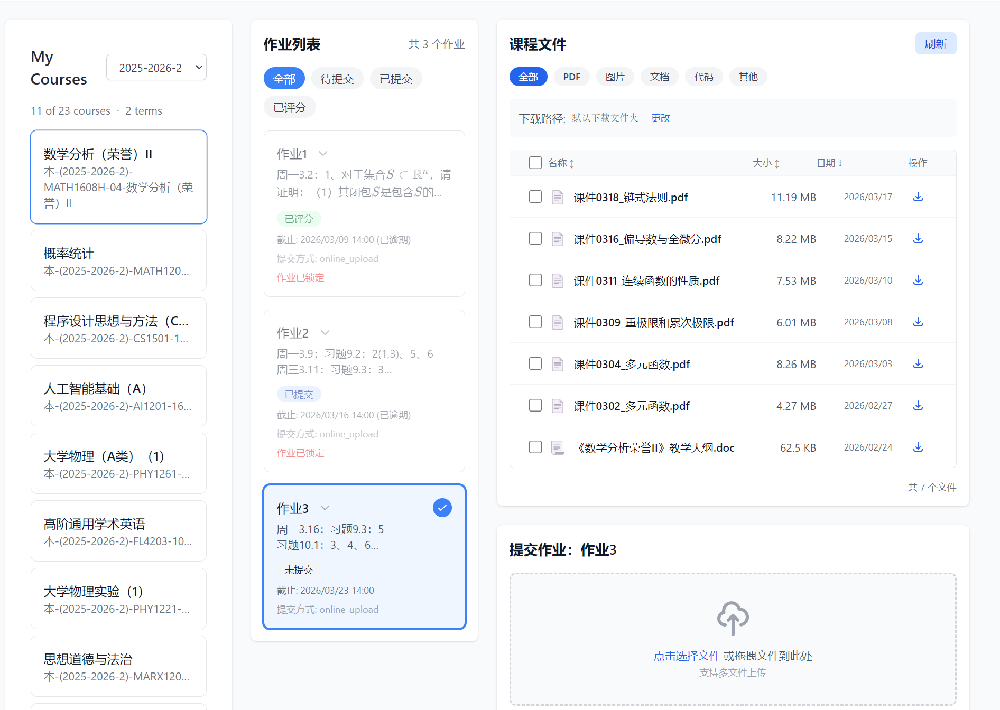
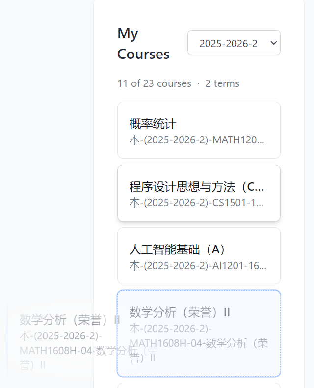
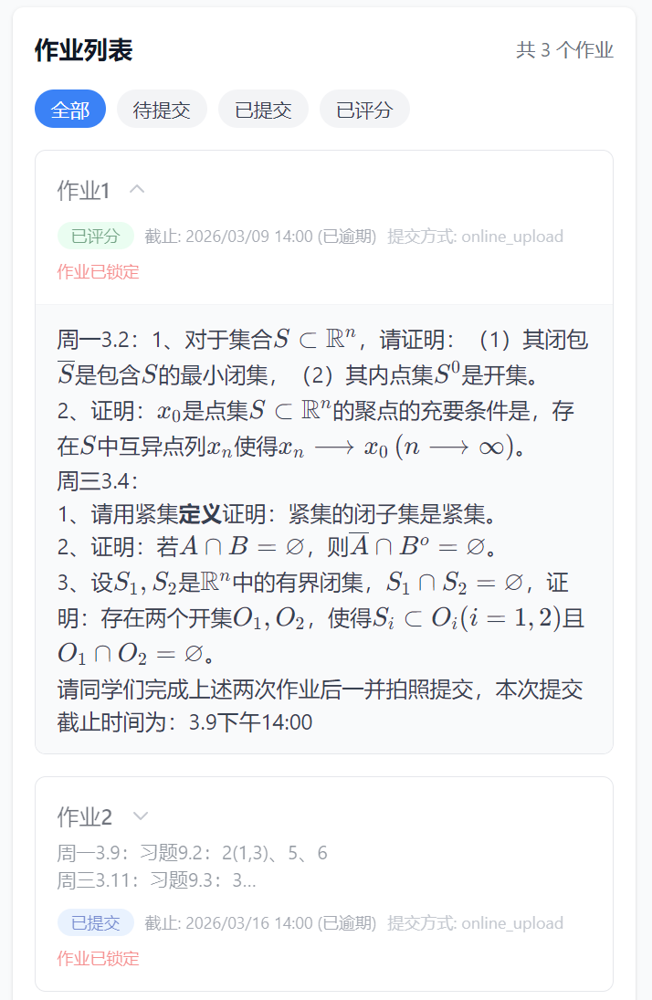
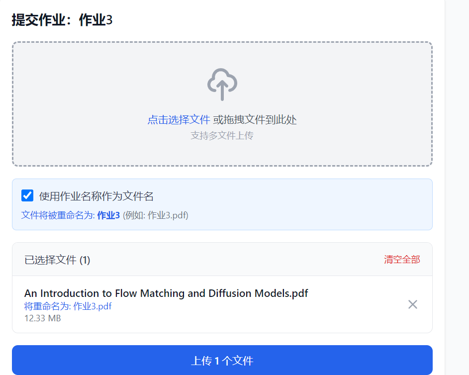
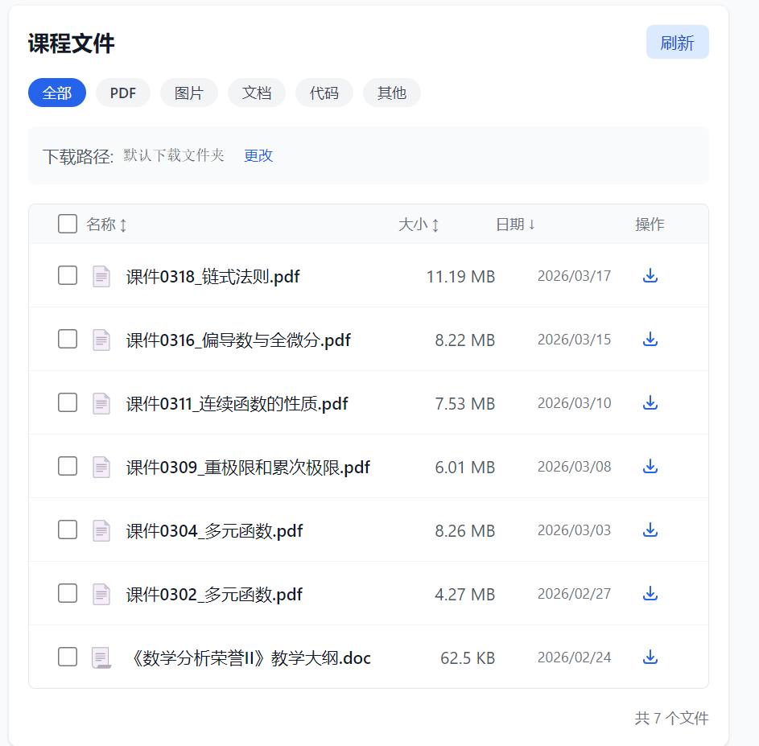
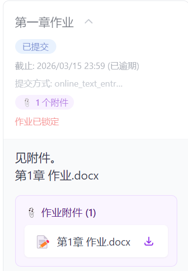
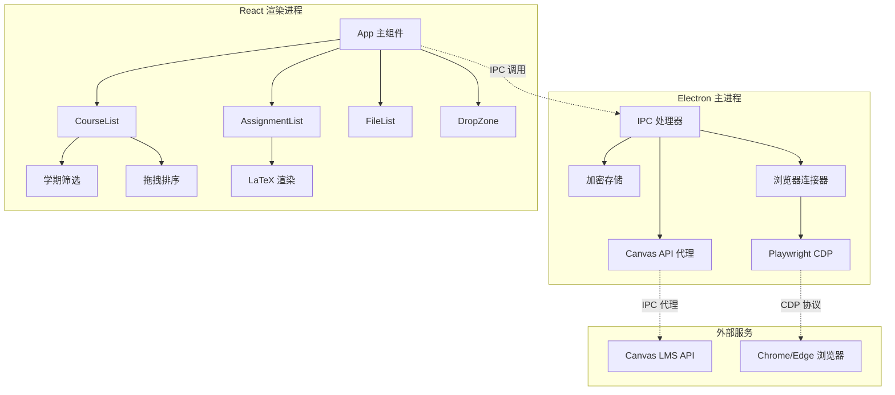

<div align="center">


# 🎓 SJTU-Canvas Drop Submit

**一个专为简化 Canvas 学习管理系统作业提交流程而设计的跨平台桌面应用**

<p align="center">
  
  
  
  
  
</p>

</div>

---

## 📖 项目简介
每次交作业都要经历「满硬盘找文件 ➔ 手动重命名 ➔ 繁琐上传」的折磨？期末复习想下载课件，却只能对着屏幕一个个狂点，甚至连保存路径都不能自己选？
告别低效，是时候升级你的 Canvas 体验了！
**Canvas Drop Submit** 是一款基于 Electron + React + TypeScript 开发的桌面应用，专为简化 Canvas 学习管理系统的作业提交流程而设计。在上传文件过程中会调用浏览器，你最好在浏览器中安装自动登录JAccount的插件以获得更好体验：https://github.com/Ac-spider/captcha-auto-fill

### ✨ 核心特性

| 特性 | 描述 |
|------|------|
| 🖱️ **拖拽上传** | 直接从文件夹拖拽文件到作业卡片，一键提交 |
| 🔐 **安全存储** | API Token 使用加密存储，保护账户安全 |
| 🌐 **浏览器复用** | 通过 Playwright 复用现有浏览器登录状态，无需重复登录 |
| 📝 **自动重命名** | 支持使用作业名称自动重命名文件 |
| 🏷️ **学期筛选** | 智能学期解析，自动归类课程 |
| 📊 **LaTeX 渲染** | 自动渲染作业描述中的数学公式 |
| 🔄 **课程排序** | 支持拖拽排序课程列表，自动保存偏好 |

---

## 🚀 快速开始

### 环境要求

- Node.js >= 18.0.0
- npm >= 9.0.0
- Windows 10/11、macOS 或 Linux

### 安装步骤

```bash
# 克隆仓库
git clone https://github.com/Ac-spider/canvas-drop-submit.git
cd canvas-drop-submit

# 安装依赖
npm install

# 启动开发模式
npm run dev
```

### 构建应用

```bash
# Windows
npm run build:win

# macOS
npm run build:mac

# Linux
npm run build:linux
```

---

## 📸 界面预览

<div align="center">

### 主界面



*清晰的四栏布局：课程列表 → 作业列表 → 课程文件 → 拖拽上传区*

### 课程列表与学期筛选



*支持学期筛选和拖拽排序*

### 作业列表与 LaTeX 公式渲染



*自动渲染数学公式，支持作业描述预览*

### 拖拽上传区域



*支持多文件拖拽，实时显示上传进度*

*一键使用作业名称重命名提交文件*

### 文件管理与下载





*便捷的课程文件浏览和下载功能*

### 浏览器自动化提交

*复用现有浏览器，自动完成登录和提交*

</div>

---

## 🏗️ 系统架构



---

## 📁 项目结构

```
canvas-drop-submit/
├── src/
│   ├── main/                    # Electron 主进程
│   │   ├── index.ts             # 主进程入口，IPC 处理器
│   │   ├── preload.ts           # 预加载脚本，暴露安全 API
│   │   ├── browserConnector.ts  # 浏览器连接器（CDP）
│   │   └── utils/
│   │       └── security.ts      # 安全工具函数
│   ├── renderer/                # React 前端
│   │   ├── components/
│   │   │   ├── Login.tsx        # API Token 登录
│   │   │   ├── CourseList.tsx   # 课程列表（学期筛选+拖拽排序）
│   │   │   ├── AssignmentList.tsx # 作业列表（LaTeX 渲染）
│   │   │   ├── DropZone.tsx     # 拖拽上传区
│   │   │   ├── FileList.tsx     # 课程文件列表
│   │   │   └── LatexRenderer.tsx # LaTeX 公式渲染
│   │   ├── hooks/
│   │   │   ├── useCanvas.ts     # Canvas API 封装
│   │   │   └── useDragDrop.ts   # 拖拽功能 Hook
│   │   ├── utils/
│   │   │   ├── termUtils.ts     # 学期工具函数
│   │   │   ├── latexUtils.ts    # LaTeX 处理工具
│   │   │   └── assignmentUtils.ts # 作业附件解析
│   │   └── App.tsx              # 主应用组件
│   └── shared/
│       └── types.ts             # 共享类型定义
├── pic/                         # 截图资源
├── docs/                        # 文档
└── resources/                   # 应用资源
```

---

## 🔧 核心功能实现

### 1. 浏览器自动化提交

使用 Playwright + Chrome DevTools Protocol 复用用户已有的浏览器登录状态：

```typescript
// 检查网页登录状态
const loginStatus = await window.electronAPI.checkWebLogin();

// 使用 Playwright 提交作业
const result = await window.electronAPI.submitAssignmentViaWeb(
  courseId,
  assignmentId,
  filePaths,
  fileNames  // 可选：自定义文件名
);
```

### 2. 智能学期筛选

支持多种学期名称格式自动解析：

```typescript
// 支持的格式：
// - "2025-2026-2"（学年-学期编号）
// - "2025-2026 Spring"（学年-季节）
// - "2025-2026 Fall"
// - "2025-2026 Summer"

const term = parseTermName("2025-2026-2");
// 结果: { startYear: 2025, endYear: 2026, semester: 2 }
```

### 3. LaTeX 数学公式渲染

自动将 Canvas `equation_images` 图片转换为可渲染的 LaTeX 公式：

```typescript
// 提取 Canvas 公式图片中的 LaTeX 代码
const latex = extractLatexFromUrl(equationImageUrl);

// 使用 react-markdown + KaTeX 渲染
<LatexRenderer content={processedHtml} />
```

### 4. 课程拖拽排序

使用 HTML5 Drag and Drop API 实现，支持持久化存储：

```typescript
// 实时 DOM 重排 + 状态同步
const handleDrop = (e: DragEvent) => {
  // 从 DOM 读取新顺序
  const newOrder = Array.from(container.children).map(...);
  // 保存到加密存储
  window.electronAPI.setCourseOrder(term, newOrder);
};
```

---

## 🔐 安全特性

- **API Token 加密存储**：使用 `electron-store` 的 encryption 功能
- **Context Isolation**：启用 `contextIsolation`，使用 `contextBridge` 安全暴露 API
- **IPC 代理模式**：所有 Canvas API 请求通过主进程代理，避免 CORS 问题
- **文件路径验证**：上传前验证文件路径合法性
- **浏览器隔离**：通过 CDP 连接用户浏览器，不共享敏感数据

---

## 🛠️ 技术栈

| 类别 | 技术 |
|------|------|
| **框架** | Electron 28, React 18, TypeScript 5 |
| **构建** | electron-vite, Vite 5 |
| **样式** | Tailwind CSS 3 |
| **状态管理** | React Hooks |
| **存储** | electron-store |
| **自动化** | Playwright |
| **测试** | Jest, React Testing Library |
| **数学渲染** | KaTeX, react-markdown |

---

## 📝 使用说明

### 首次使用

1. 启动应用后，输入 Canvas API Token
2. 应用会自动获取课程列表
3. 选择学期和课程
4. 选择要提交的作业
5. 拖拽文件到上传区域
6. 点击上传按钮完成提交

### 获取 API Token

1. 登录 Canvas 网页版
2. 进入「账户设置」→「批准的应用」
3. 生成新的访问令牌
4. 复制令牌到应用

---

## 🤝 贡献指南

欢迎提交 Issue 和 Pull Request！

1. Fork 本仓库
2. 创建特性分支 (`git checkout -b feature/AmazingFeature`)
3. 提交更改 (`git commit -m 'Add some AmazingFeature'`)
4. 推送到分支 (`git push origin feature/AmazingFeature`)
5. 打开 Pull Request

---

## 📄 许可证

本项目基于 [MIT](LICENSE) 许可证开源。

---

## 🙏 致谢

- [Canvas LMS](https://www.instructure.com/canvas) - 学习管理系统
- [Electron](https://www.electronjs.org/) - 跨平台桌面应用框架
- [React](https://react.dev/) - 用户界面库
- [Playwright](https://playwright.dev/) - 浏览器自动化工具
- [KaTeX](https://katex.org/) - 数学公式渲染引擎

---

<div align="center">

**Made with ❤️ by LvxSeraph**

</div>
